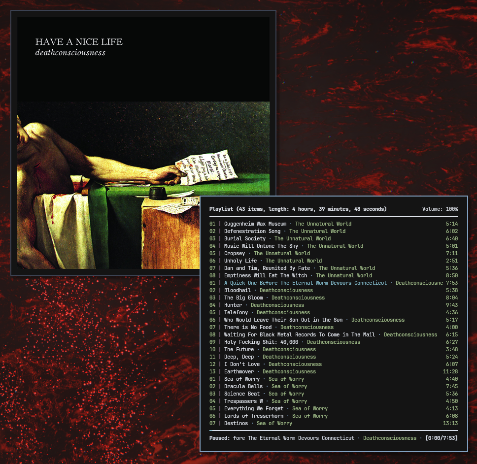

[](https://github.com/milivojevicu/mpcover/actions/workflows/check.yml)

# MPCover: Album cover display for [MPD](https://github.com/MusicPlayerDaemon/MPD)

Python program for displaying album covers of music currently playing through MPD using tkinter.

<p align="center">
  
</p>

## Installation

Install the package from PyPI using `pip`:

```bash
pip install mpcover
```

## Configuration

The configuration file should be located in the user home directory with the name ".mpcover.ini".

For more information on where the user home directory is,
reference [`os.path.expanduser`](https://docs.python.org/3/library/os.path.html#os.path.expanduser).

Example configuration file:

```ini
[connection]
# Connection settings. The password is optional, to leave it unset simply remove
# the "password = ..." line from the configuration file.
host = localhost
port = 6600
password = example_password

[logging]
level = info

[style]
background = #141414
padding = 12

[binds]
# The values should be `tkinter` key bind strings.
refresh = r
quit = q

[other]
image_size = 512
```

